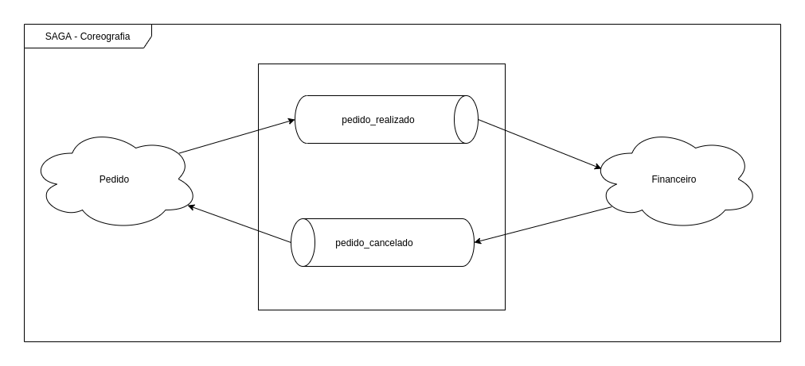

## SAGA Pattern: ##

Em uma arquitetura de microsserviços onde cada serviço deve ter seu proprio banco de dados e não pode ser acessivel diretamente por outro serviço, mesmo gerando um acoplamento baixo isso introduz alguns problemas e entre eles a conscistencia de dados.

O padrão de design SAGA é utilizado em transações distribuidas, servindo para gerenciar a conscistencia dos dados. Uma SAGA nada mais do que uma sequencia de transações que atualiza cada serviço e disparando notificaçoes (evento ou mensagem) para a proxima transação, ou compensação, transações que neutralizam as anteriores.

A SAGA pode ser orquestrada ou coreografada:

- Orquestrada: Utiliza um ponto que controla e centraliza a SAGA.

- Coreografada: Troca de mensagens ou eventos sem um ponto de controle centralizado.

## Dependências: ##

- Java 11
- Spring 2.0
- Gradle
- RabbitMQ
- Docker

## Referências: ##

[Saga - Microsoft](https://docs.microsoft.com/pt-br/azure/architecture/reference-architectures/saga/saga#:~:text=The%20saga%20design%20pattern%20is,a%20pr%C3%B3xima%20etapa%20da%20transa%C3%A7%C3%A3o.)
[Saga - infoq](https://www.infoq.com/br/news/2018/04/data-consistency-microservices/)
[Microservice](https://microservices.io/patterns/data/saga.html)

## Detalhes da POC: ##

Foi desenvolvido dois seriços para simular um pedido. Um dos serviços é o responsavel por criar o pedido e o outro serviço é responsavel pelo controle financeiro.

Abaixo a SAGA:


#### Passo a passo usando Docker: ####

- Criar a rede
```
docker network create --driver bridge api_saga
```

- Subir container RabbitMQ
```
docker run --name api_rabbitmq --net api_saga -d -p 8085:15672 -p 5672:5672 -p 25676:25676 rabbitmq:3-management
```

- Configurar Rabbit
```
login: guest
senha:guest

1) Criar exchanges de quando um Pedido é realizado. Name: pedido_realizado

2) Criar fila do exchanges pedido_realizado. Name: financeiro

3) Fazer o bind entre o exchanges pedido_realizado e a queue financeiro

4) Criar o exchanges do Financeiro quando um pedido for cancelado. Name: pedido_cancelado

5) Criar fila do exchanges pedido_cancelado. Name: pedido_cancelado

6) Fazer o bind entre o exchanges pedido_cancelado e a queue pedido_cancelado
```

- Executar o build no projeto pedido
```
./gradlew clean  build
```

- Gerar imagem do projeto pedido
```
docker build --tag <tag do projeto pedido> .
```

- Cria o container do pedido
```
docker run --name api-pedido --net api_saga -p 8081:8081 -d <nome da tag do projeto pedido>
```

- Executar o build no projeto financeiro
```
./gradlew clean  build
```

- Gerar imagem do projeto financeiro
```
docker build --tag <nome da tag do projeto financeiro> .
```

- Criar o container Financeiro

```
docker run --name api-financeiro --net api_saga -p 8082:8082 -d <nome da tag do projeto financeiro>
```

- Para testar:
```
URL: http://localhost:8081/pedido
content-type: application/json
body:
{
 "nome":"João Paulo",
  "email":"joaopaulo@teste.com",
  "cpf":"94168595265",
  "itens":[
      {
        "descricao": "TV PHILCO"
      }
  ]
}
```

## OBS: ##

- Apenas para efeito de testes, o CPF não é necessario ser valido
- Para ver o erro de credito insuficiente usar o cpf: 11122233344
- Proximos passos configurar o K8s